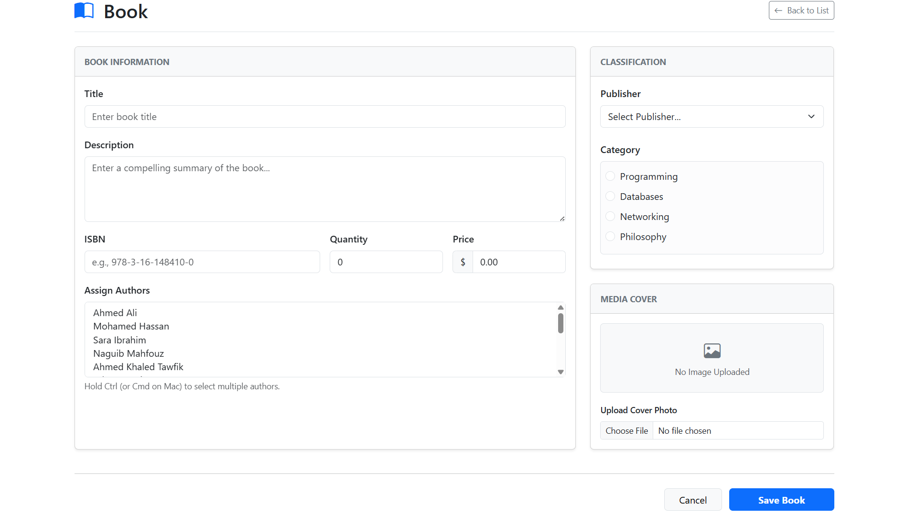

# BookStore

BookStore is a web application designed to provide a complete online bookstore experience. It allows customers to browse and purchase books while providing administrators with tools to manage the bookstore's catalog and related data.

### Key Features & Implementation
* **Authentication & Authorization:** Implemented secure user authentication and Role-Based Access Control utilizing **ASP.NET Core Identity**.
* **E-Commerce Workflow:** Developed a complete checkout pipeline including a dynamic shopping cart, order processing, and a comprehensive order management system.
* **Payment Gateway Integration:** Integrated **Paymob API** for secure credit card processing, implementing **Webhooks** for real-time payment status synchronization and order validation.
* **Advanced Search & Pagination:** Built an optimized product catalog supporting multi-criteria filtering (by Category, Publisher, and Author), text search, and server-side pagination to ensure high performance with large datasets.
* **Admin Dashboard:** Created a secure administrative portal for complete CRUD operations on books, categories, inventory management, and user-role assignments.
* **Database Architecture:** Designed a normalized relational database schema for complex data relations (Users, Orders, Payments, and Catalog) using **Entity Framework Core**.
* **Media & Inventory Management:** Implemented file upload streams for book cover images alongside an automated inventory tracking system.

## Technologies

### Backend

* ASP.NET Core MVC
* C#
* Entity Framework Core
* LINQ

### Database

* SQL Server

### Authentication & Authorization

* ASP.NET Core Identity

### Frontend

* Bootstrap 5
* HTML5
* CSS3
* JavaScript

### Payment Integration

* Paymob Payment Gateway

## Database

The database schema is illustrated below.


## Project Structure

```text
BookStore
├── Areas
│   ├── Admin
│   │   ├── Controllers
│   │   ├── Models
│   │   └── Views
│   └── Identity
│       └── Pages
├── Controllers
├── Data
│   └── Migrations
├── DTOs
│   └── Paymob
├── Models
├── Services
│   ├── Interfaces
│   └── Implementation
├── ViewModels
├── Views
├── wwwroot
│   ├── css
│   ├── Images
│   ├── js
│   └── lib
└── Program.cs
```

## Getting Started

1. Clone the repository.

```bash
git clone https://github.com/Khaled91067/BookStore.git
```

2. Update the connection string and Paymob configuration in `appsettings.json`.

3. Apply the database migrations.

```bash
dotnet ef database update
```

4. Run the application.

```bash
dotnet run
```

## Screenshots

### Home Page


### Book Details


### Shopping Cart


### Checkout


### Pay


### Payment Result


### Manage Books




### Manage Roles


## Future Improvements

- Email notifications
- Product reviews
- Wishlist
- Discount coupons
- Docker support
- Unit Testing

## Author

**Khaled Ahmed**

Software Developer

LinkedIn: https://www.linkedin.com/in/khaled-ahmed-53a3a4295/

GitHub: https://github.com/Khaled91067 
