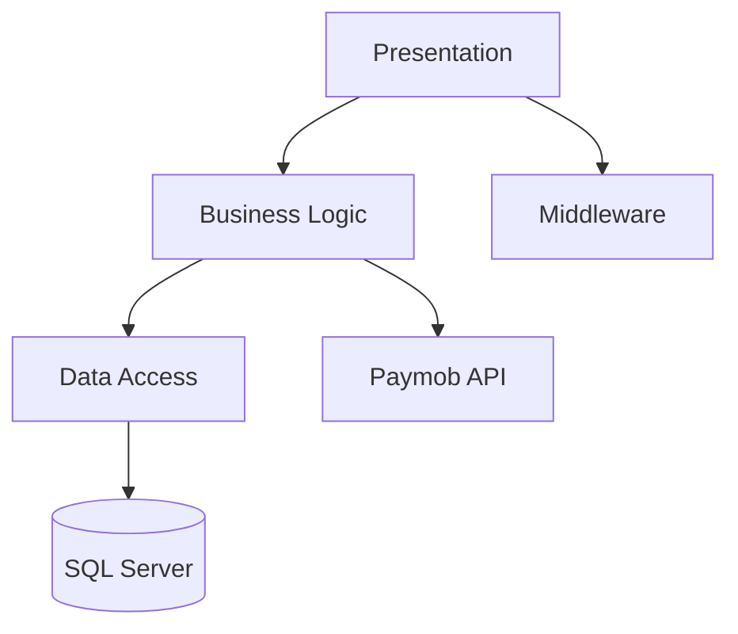
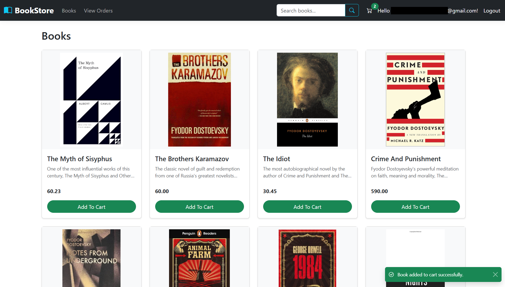
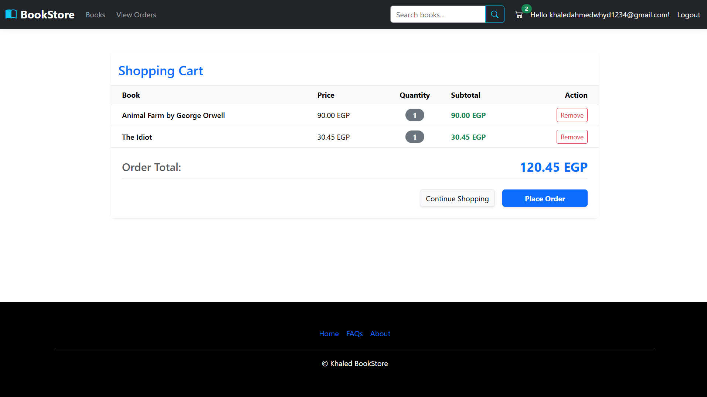
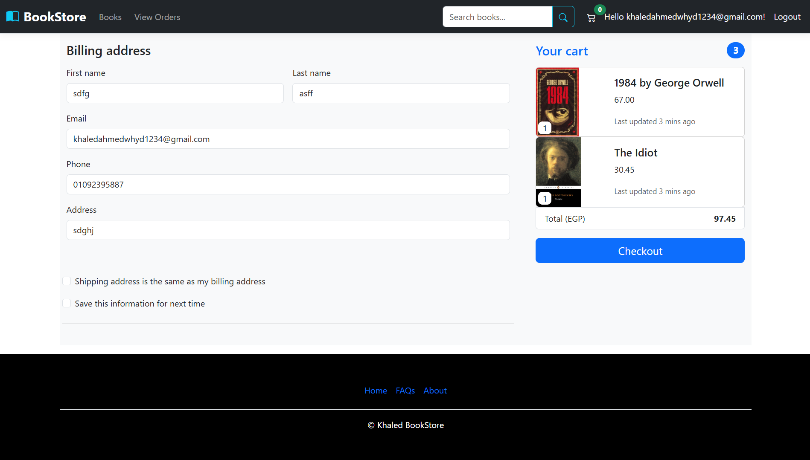
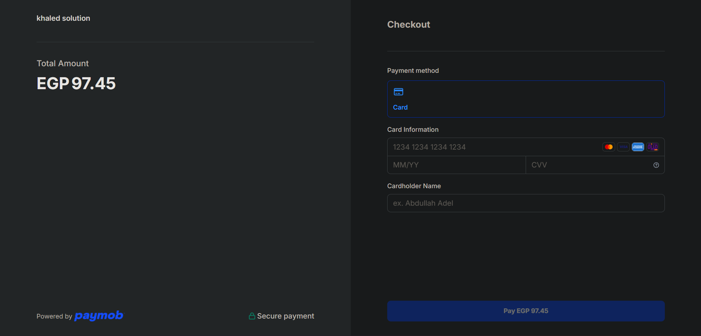
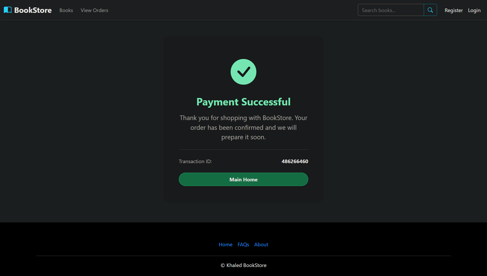
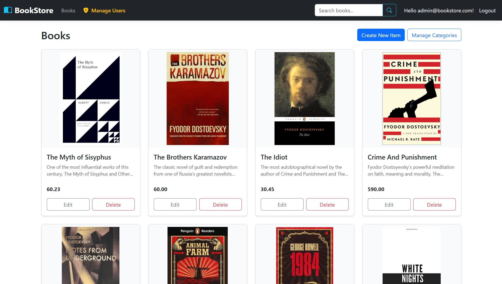
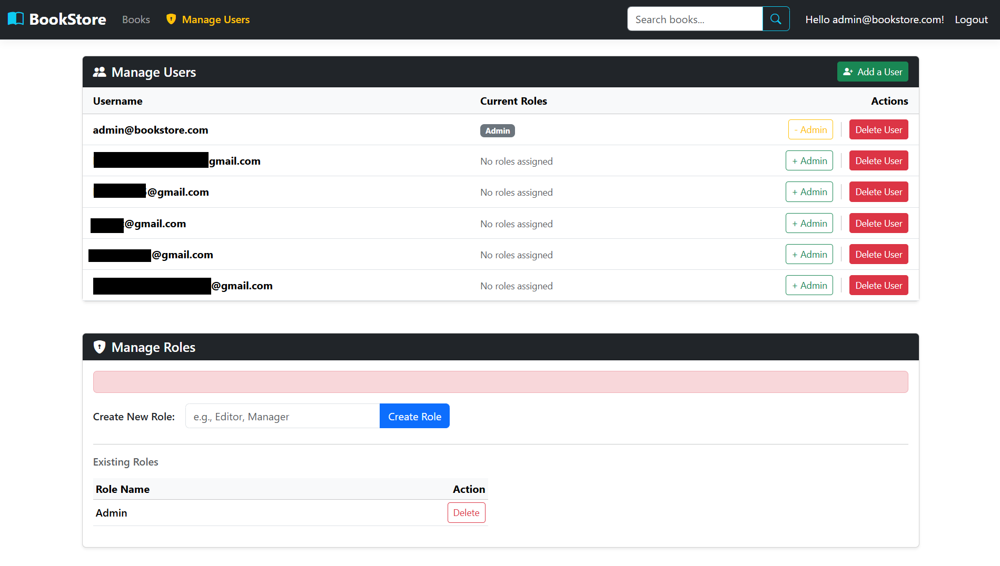

# 📚 BookStore

[](https://github.com/Khaled91067/BookStore/actions/workflows/dotnet.yml)


**BookStore** is an e-commerce web application built with **ASP.NET Core MVC (.NET 10)** and **Entity Framework Core**. It provides an online bookstore where customers can browse books, manage a shopping cart, place orders, and pay online using Paymob. The application also includes an administrative portal for catalog and user management.

---

## 🌐 Live Demo & Testing

🚀 **Live Demo:** https://bookstore.khaled303.dev/

Use the live demo to browse the catalog, add books to the cart, and complete the checkout process.

> **Demo Account:** `customer@bookstore.com` / `#BookStore123`

The application uses the **Paymob Sandbox** environment.

To test the payment flow:

1. Add one or more books to the shopping cart.
2. Proceed to **Checkout**.
3. Select **Online Payment**.
4. Complete the payment using the official Paymob Sandbox test card credentials.

👉 **Official Paymob Sandbox Test Cards:**  
https://developers.paymob.com/paymob-docs/need-help/faq/test-credentials

> **Note:** This demo uses the Paymob Sandbox environment. Do not use real payment cards.

---

## 🌟 Key Features

- 🛍️ Customer storefront with search, filtering, pagination, and product details.
- 🛒 Session-based shopping cart with stock validation.
- 💳 Paymob payment integration using the Intention API and Webhooks.
- 💵 Cash on Delivery checkout option.
- 🔐 ASP.NET Core Identity with role-based authorization.
- ⚙️ Administrative portal for managing books, categories, authors, roles, and users.
- ⚡ Rate limiting, structured logging, exception handling, and PII masking.

---

## 🛠️ Technology Stack

| Layer | Technology | Purpose |
| --- | --- | --- |
| Framework | ASP.NET Core MVC (.NET 10) | MVC web application |
| Data Access | Entity Framework Core | ORM & LINQ |
| Database | SQL Server / LocalDB | Data persistence |
| Identity | ASP.NET Core Identity | Authentication & Authorization |
| Logging | Serilog | Structured logging |
| Payments | Paymob API | Online payments |
| Rate Limiting | ASP.NET Core RateLimiter | Request throttling |
| Testing | xUnit & Moq | Unit testing |
| CI/CD | GitHub Actions & Azure App Service | Build, test, deployment |

---

## 🏛️ Architecture Summary

BookStore follows a layered architecture separating presentation, business logic, data access, and infrastructure.



See **docs/ARCHITECTURE_OVERVIEW.md** for more details.

---

## 📂 Project Structure

```text
BookStore/
├── Areas/           # Admin and Identity
├── Controllers/     # MVC controllers
├── Services/        # Business logic
├── Data/            # DbContext, migrations, seeding
├── DTOs/            # Data Transfer Objects
├── Models/          # Domain entities
├── ViewModels/      # View models
├── Middleware/      # Custom middleware
├── Helpers/         # Helper utilities
├── Extensions/      # Dependency injection
├── Docs/            # Documentation assets
└── Program.cs       # Application entry point

BookStore.Tests/
└── Services/        # Unit tests
```

---

## 📸 Screenshots

### Customer Storefront


### Book Details


### Shopping Cart


### Checkout & Payment






### Admin Portal




---

## 🚀 Getting Started

### Prerequisites

- .NET 10 SDK
- SQL Server / LocalDB
- Git

### Installation

```bash
git clone https://github.com/Khaled91067/BookStore.git
cd BookStore
```

### Configuration

Update the `DefaultConnection` connection string in `appsettings.Development.json` or User Secrets.

### Database

```bash
dotnet ef database update --project BookStore
```

### Run

```bash
dotnet run --project BookStore
```

The application seeds default roles, an administrator account, and sample catalog data on first startup.

For detailed setup instructions, see **docs/GETTING_STARTED_AND_CONFIGURATION.md**.

---

## ☁️ Deployment

BookStore is deployed to **Azure App Service** using **GitHub Actions**. Every push to the `main` branch automatically builds, runs the test suite, and deploys the application.

See **docs/CI_CD_AND_DEPLOYMENT.md** for deployment details.

---

## 📖 Documentation

The `docs/` directory contains detailed documentation for:

- Architecture
- Getting Started
- Business Rules
- Authentication & Authorization
- Database & Data Access
- API & Integrations
- Cross-Cutting Concerns
- CI/CD & Deployment
- Testing
- Security

---

## 👤 Author & License

- **Author:** Khaled Ahmed
- **LinkedIn:** https://www.linkedin.com/in/khaled-ahmed-53a3a4295/
- **GitHub:** https://github.com/Khaled91067
- **License:** MIT License
