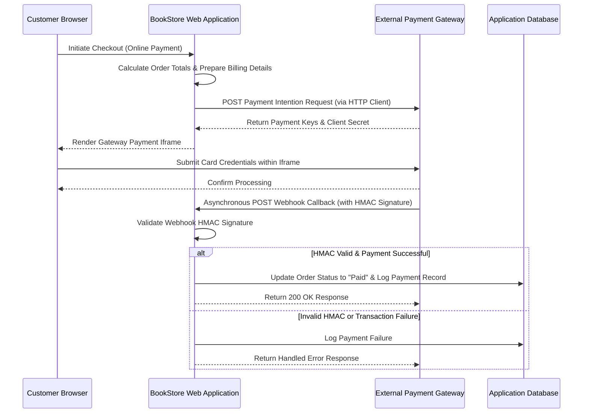

# BookStore - API & Integrations Specification

## Overview

**BookStore** integrates with payment processing providers (**Paymob Gateway API**) to handle credit card payments, payment intention creation, iframe checkout rendering, and transaction status updates via Webhooks.

---

## Integration Architecture & Sequence Flow

---

## Service Contracts & Dependency Injection

Payment integration logic is defined behind a service interface in `Services`:
* **HTTP Client Management**: Integration services use typed HTTP clients registered via `AddHttpClient` in the service collection during startup.
* **Responsibilities**:
  1. Translating internal order data into gateway intention creation requests.
  2. Executing HTTPS API requests to external gateway endpoints.
  3. Verifying incoming webhook HMAC signatures.

---

## Data Transfer Objects (`DTOs`)

External API communication uses strongly typed Data Transfer Objects residing in `DTOs`:

1. **Payment Intention Request Contracts**: Encapsulates transaction amount (converted to currency cents), currency codes, integration identifiers, and customer billing metadata (name, email, phone).
2. **Customer Billing Metadata Contracts**: Captures customer details required by gateway fraud prevention checks.
3. **Payment Intention Response Contracts**: Deserializes gateway responses containing client secrets needed to embed checkout payment frames.
4. **Webhook Callback Payload Contracts**: Represents incoming webhook notification payloads, containing transaction identifiers, transaction execution status flags, order references, and HMAC signatures.

---

## Webhook Endpoint & HMAC Security

* **Callback Route**: Hosted within presentation controllers (`/Payment/Callback`) to accept inbound HTTP POST notifications.
* **HMAC Signature Verification**:
  To verify that webhook callbacks originate from the payment provider, the integration service calculates a SHA-512 HMAC hash across incoming callback fields using a secret key (`Paymob:Hmac`).
* **Webhook Processing**:
  The system verifies whether a transaction reference has already been processed before updating order states, avoiding duplicate updates from duplicated webhooks.
