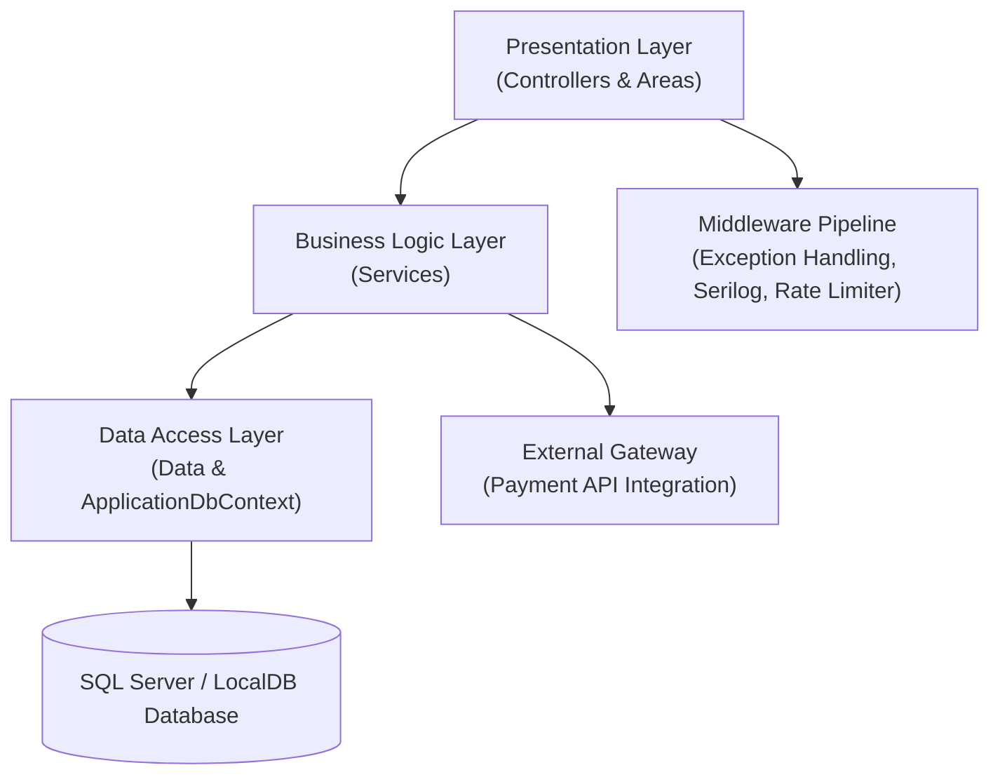

# BookStore - Architecture Overview

## Executive Summary

**BookStore** is an e-commerce application built with **.NET 10.0 (ASP.NET Core MVC)** and **Entity Framework Core 10.0**. The application provides an online bookstore platform supporting customer browsing, shopping cart and checkout processing, third-party payment gateway integration, inventory control, and an administrative portal for catalog and security management.

This document details the system architecture, software design patterns, component topology, and core technical stack powering the platform.

---

## Technical Stack Overview

| Layer / Subsystem | Technology / Package | Version / Framework | Purpose |
| :--- | :--- | :--- | :--- |
| **Presentation / MVC** | ASP.NET Core MVC | .NET 10.0 | Routing, Razor rendering, and MVC action controllers |
| **ORM / Data Access** | Entity Framework Core | 10.0.10 | Object-Relational Mapping (ORM) and data access |
| **Database** | SQL Server / LocalDB | SQL Server 2022+ | Relational data persistence |
| **Identity & Security** | ASP.NET Core Identity | 10.0.10 | User authentication, session management, and RBAC |
| **Logging** | Serilog | 9.0.0 | Structured logging with Console and rolling File sinks |
| **Payment Gateway** | Paymob API Integration | HTTP Client | Third-party card processing, Intention API, and Webhooks |
| **Rate Limiting** | ASP.NET Core RateLimiter | Native .NET 10 | Fixed-window request throttling per client IP |
| **Automated Testing** | xUnit & Moq | .NET 10 | Unit testing for business service components |
| **CI/CD** | GitHub Actions | Workflows | Automated build, test, and Azure Web App deployment |

---

## Architectural Principles & Design Patterns

BookStore follows a **Layered Architecture** to separate presentation, business logic, data access, and infrastructure layers:



### Applied Architectural Patterns

1. **Service Layer Pattern**:
   * Core business domain logic is encapsulated within a dedicated service layer residing in `Services`.
   * Controllers residing in `Controllers` and `Areas` handle HTTP request parsing, model binding, and View rendering.

2. **Data Context Abstraction (via EF Core)**:
   * Data context abstractions residing in `Data` encapsulate entity persistence, LINQ queries, and database transactions.

3. **Dependency Injection & Extensions**:
   * Application services, database context options, logging providers, rate limiting policies, and HTTP client factories are registered via extension methods during application startup.

4. **Data Transfer Object (DTO) Pattern**:
   * Integrations with external payment gateways rely on DTOs residing in `DTOs` to serialize and deserialize external network payloads.

5. **Middleware Pipeline Pattern**:
   * Cross-cutting concerns (logging, exception handling, rate limiting) are injected as middleware components directly into the HTTP request processing pipeline.

6. **Modular Area Architecture**:
   * The application segregates customer-facing storefront capabilities from administrative tools using ASP.NET Core **Areas** (`Areas/Admin` and `Areas/Identity`).

---

## Component Topology & Architectural Boundaries

```text
BookStore/
├── Areas/              # Segregated application areas (Admin portal & Identity management)
├── Controllers/        # Public customer-facing MVC controllers
├── Services/           # Domain business logic layer & interface contracts
├── Data/               # Entity Framework Core context, entity configurations, & seeding
├── DTOs/               # Data Transfer Objects for external API integrations
├── Models/             # Core domain entities & data contracts
├── ViewModels/         # Presentation models for UI rendering
├── Middleware/         # Custom HTTP pipeline middleware components
└── Helpers/            # Cross-cutting utilities (log masking & formatting)
```

---

## System Boundaries & Entry Points

* **Public Storefront Boundary**: HTTP(S) endpoints mapped to public controllers handling storefront browsing, cart management, and order submission.
* **Administrative Boundary**: Restricted routes under `/Admin/*` enforced via area routing and role-based authorization attributes.
* **External Integration Boundary**: Inbound callback endpoints for payment status synchronization and outbound HTTP requests to payment gateways.
