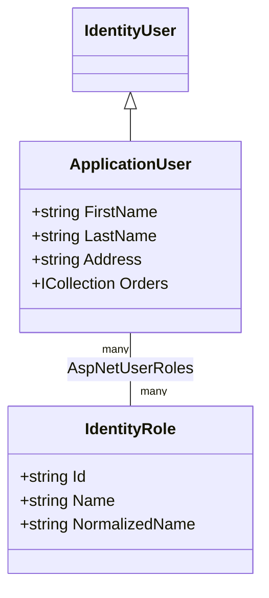
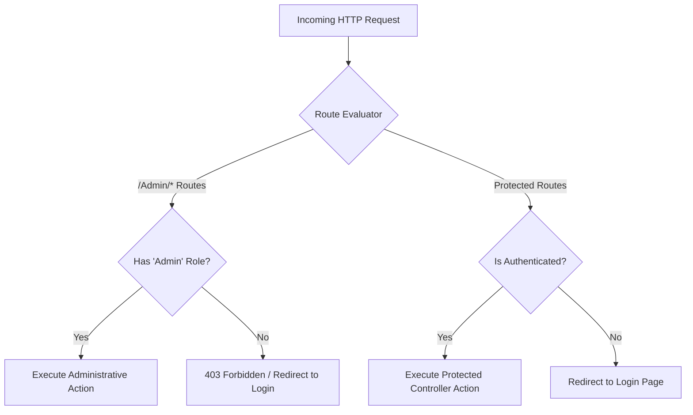

# BookStore - Authentication & Authorization

## Overview

Security, user identity, and access control in **BookStore** are implemented using **ASP.NET Core Identity** combined with **Role-Based Access Control (RBAC)**, authorization attributes, and HTTP session state protection.

---

## Identity Architecture & User Model

### User Model Extension Strategy

The application user model (`ApplicationUser`) inherits core authentication and identity capabilities from ASP.NET Core `IdentityUser` while appending custom user profile attributes (`FirstName`, `LastName`, `Address`) and domain relationship navigations (`Orders`).

---

## Role-Based Access Control (RBAC)

The system defines two security role levels:

| Role Name | Architectural Scope & Responsibilities |
| :--- | :--- |
| **Admin** | System administration. Access to administrative area endpoints (`Areas/Admin`). Manages catalog data, user accounts, security roles, and system dashboard analytics. |
| **Customer** | Standard user privileges. Browses catalog items, manages personal cart state, submits orders, views order history, and manages personal account details. |

---

## Route & Area Authorization Rules

Endpoint protection is enforced using ASP.NET Core authorization attributes applied to controllers and action methods:

### Authorization Rules
1. **Administrative Controllers (`Areas/Admin`)**: Enforce area routing constraints and restrict execution to users in the `Admin` role (`[Authorize(Roles = "Admin")]`).
2. **Customer Checkout & Orders**: Restrict access to authenticated users, ensuring users can access only their own order records.

---

## Session & Cookie Security Policies

* **Session Idle Timeout**: HTTP sessions are configured with a 30-minute idle timeout.
* **Cookie Protection**:
  * `HttpOnly`: Prevents client-side scripts from accessing session authentication cookies.
  * `SameSite`: Enforces SameSite cookie attributes (`Lax`/`Strict`) to protect against CSRF attacks.
  * `Secure`: Transmits cookies over HTTPS requests.
