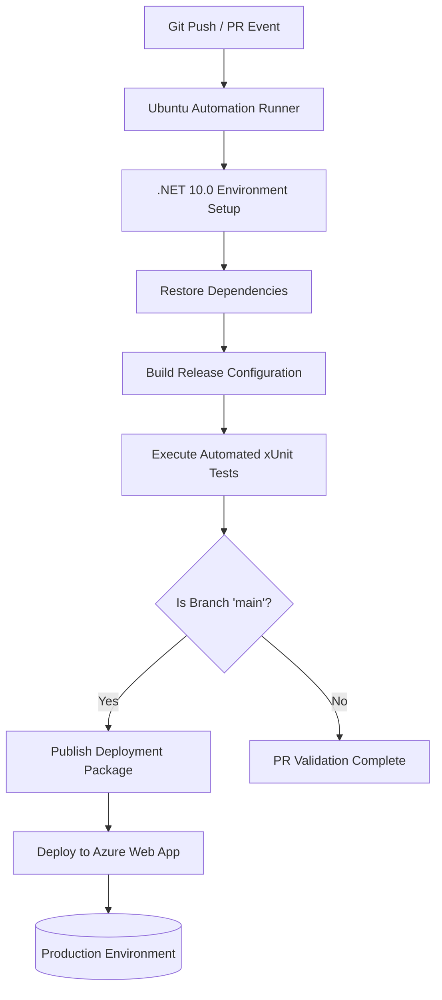

# BookStore - CI/CD & Deployment Specification

## Overview

Continuous integration, automated testing, artifact publishing, and cloud deployment for **BookStore** are managed via **GitHub Actions** targeting **Azure App Services**.

---

## Deployment Pipeline Architecture

---

## Pipeline Execution Stages

### 1. Workflow Triggers
* **Push Events**: Triggers on code pushes to the `main` branch or any `feature/**` branches.
* **Pull Request Events**: Triggers validation builds on pull requests targeting `main`.

### 2. Automated Pipeline Stages
1. **Source Checkout**: Pulls repository source code using `actions/checkout@v4`.
2. **Environment Initialization**: Configures the target .NET 10.0 SDK environment on the runner using `actions/setup-dotnet@v4`.
3. **Dependency Restoration**: Restores required NuGet packages (`dotnet restore`).
4. **Project Compilation**: Compiles the solution under `Release` configuration (`dotnet build`).
5. **Automated Test Execution**: Runs unit test suites (`dotnet test`).
6. **Package Publishing**: Packages web application artifacts into a deployment directory (`dotnet publish`, executed when branch is `main`).
7. **Azure Deployment**: Deploys application packages to target Azure App Service `bookstore-app-khaled` using deployment credentials stored in GitHub repository secrets (`AZURE_WEBAPP_PUBLISH_PROFILE`).

---

## Deployment Configuration & Environment Variables

### Deployment Secrets
* **Azure Publish Credentials**: Authentication credentials for Azure App Service deployment are stored in repository secrets (`AZURE_WEBAPP_PUBLISH_PROFILE`).

### Production Runtime Settings
The production cloud environment overrides development settings via host environment configuration:
* `ConnectionStrings__DefaultConnection`: Production database connection string.
* `Paymob__ApiKey` & `Paymob__Hmac`: Production payment gateway integration keys and HMAC verification secrets.
* `ASPNETCORE_ENVIRONMENT`: Set to `Production`.
