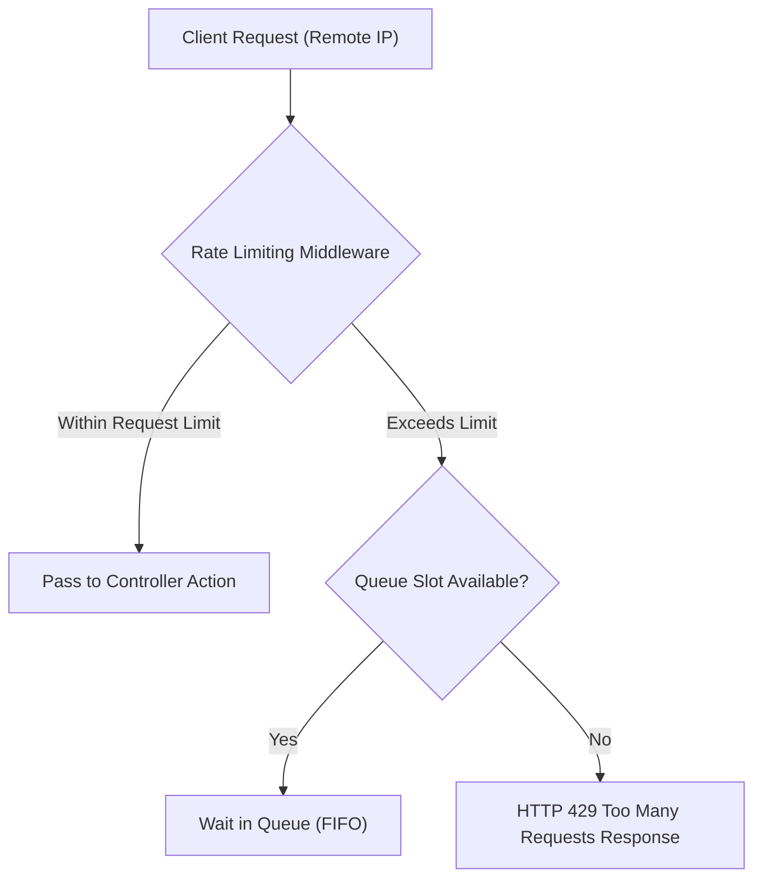

# BookStore - Cross-Cutting Concerns Specification

## Overview

This document specifies cross-cutting concerns in **BookStore**: Structured Logging, PII Data Masking, Policy-Based Rate Limiting, Memory Caching, and Global Exception Handling Middleware.

---

## 1. Structured Logging Engine (Serilog)

BookStore uses **Serilog** as its logging framework, capturing application diagnostic events with JSON contextual properties.

### Logging Architecture
* **Bootstrap Logging**: Initialized during startup to record bootstrapping failures before the web application host builds.
* **Serilog Pipeline Integration**: Integrated into the host environment to read settings from application configuration sources and enrich log records.
* **Logging Sinks**:
  * **Console Sink**: Real-time stdout output for development diagnostics and containerized environments.
  * **File Sink**: Daily rolling log files stored under `logs/bookstore-yyyyMMdd.log` with automatic log retention limits.

---

## 2. Sensitive Data Masking (`Helpers`)

To prevent recording Personally Identifiable Information (PII) or credit card attributes in system logs, utility components residing in `Helpers` enforce data masking routines prior to log emission.

### Data Masking Standards

| Target Data Category | Example Raw Data | Standard Masked Output |
| :--- | :--- | :--- |
| **Email Address** | `customer@example.com` | `c***r@example.com` |
| **Phone Number** | `+1234567890` | `+123****890` |
| **Credit Card Number** | `4111111111111111` | `4111-XXXX-XXXX-1111` |

---

## 3. Policy-Based Rate Limiting

Rate limiting middleware protects the system against high request volume by enforcing fixed-window request limits partitioned by client IP address.

### Configured Rate Limiting Policies

1. **Global Throttling Policy**:
   * Window: 1 Minute
   * Request Limit: 100 Requests per window per client IP
   * Queueing: Up to 5 requests queued (oldest processed first)
2. **Strict Endpoint Policy**:
   * Window: 1 Minute
   * Request Limit: 10 Requests per window per client IP
   * Queueing: 0 (Immediate rejection)
   * Applied to sensitive endpoints (payment callbacks).

### Rejection Response
When limits are breached, the server returns an `HTTP 429 Too Many Requests` JSON response.

---

## 4. In-Memory Caching Strategy

The application registers memory caching services (`IMemoryCache`) to optimize database queries:
* **Scope**: Services in `Services` cache lookup data (such as category listings and catalog aggregate statistics).
* **Eviction Policies**: Uses absolute expiration timeouts combined with cache invalidation executed whenever administrative actions create or modify catalog entities.

---

## 5. Global Exception Handling Middleware (`Middleware`)

Unhandled runtime exceptions are intercepted by custom middleware residing in `Middleware`:

* **Execution Order**: Placed at the top of the HTTP request processing pipeline to catch unhandled errors from downstream controllers or services.
* **Development Mode**: Displays developer exception diagnostic pages (`app.UseMigrationsEndPoint()`).
* **Production Mode**: Intercepts unhandled errors, logs error traces via Serilog with PII masking, and redirects users to generic error views without exposing stack traces.
