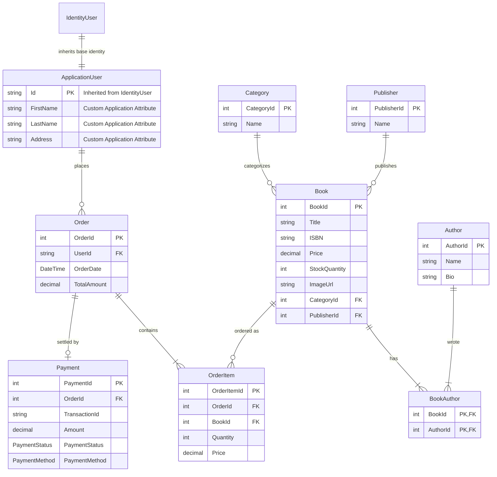

# BookStore - Database & Data Access Specification

## Overview

The data persistence layer in **BookStore** is designed using **Entity Framework Core 10.0** against **SQL Server**. Data access, object-relational mapping, schema configuration, and transaction boundaries are managed through an Entity Framework database context residing in `Data`.

---

## Entity-Relationship Diagram (ERD)



---

## Database Design Decisions

1. **User Identity Integration**:
   * The database uses ASP.NET Core Identity infrastructure tables (`AspNetUsers`, `AspNetRoles`, `AspNetUserRoles`).
   * Application user entities extend identity models to add user profile fields (`FirstName`, `LastName`, `Address`).

2. **Join Entity for Multi-Author Books**:
   * Books and authors participate in a many-to-many relationship. An explicit join table (`BookAuthor`) with a composite primary key (`{ BookId, AuthorId }`) is implemented to normalize data access and support books written by multiple authors.

3. **Financial Price Preservation**:
   * In `OrderItem`, unit prices are stored at the time of order creation (`Price`). This prevents price changes in the master catalog from altering historical order records.

4. **Monetary Precision**:
   * Financial values (`Book.Price`, `OrderItem.Price`, `Order.TotalAmount`, `Payment.Amount`) use `decimal` column definitions to prevent binary floating-point rounding inaccuracies.

5. **Reference Entities**:
   * Category and Publisher details are stored in master entities (`Category`, `Publisher`) to enforce relational integrity and eliminate duplicate string values across book records.

6. **Cascade Deletion Rules**:
   * Deleting an `Order` cascades to delete associated line items (`OrderItem`). Foreign keys targeting master entities (`Book`, `Category`, `Author`) restrict deletion if active relations exist.

---

## Data Context & Fluent API Configurations (`Data`)

The database context inherits from `IdentityDbContext<ApplicationUser>`, registering custom entity sets and applying Fluent API mappings:

* **Composite Primary Keys**: Formally configured on `BookAuthor` (`builder.Entity<BookAuthor>().HasKey(ba => new { ba.BookId, ba.AuthorId })`).
* **Decimal Precision**: Configured for monetary columns to prevent precision truncation warnings.
* **Relationship Mappings**: Foreign key constraints and cascade rules configured across domain entities.

---

## Database Seeding Engine (`Data`)

Initialization runs during application startup:
1. **Security Roles**: Ensures standard `Admin` and `Customer` identity roles exist.
2. **Admin Account**: Creates the initial system administrator account (`admin@bookstore.com`) with `Admin` role privileges if unpopulated.
3. **Catalog Data**: Seeds initial categories, publishers, authors, and books when tables contain no records.

---

## Schema Migration Management

Schema changes are tracked and applied using EF Core migrations:

```bash
# Generate a new migration
dotnet ef migrations add <MigrationName> --project BookStore

# Apply migrations to the SQL Server database
dotnet ef database update --project BookStore
```
