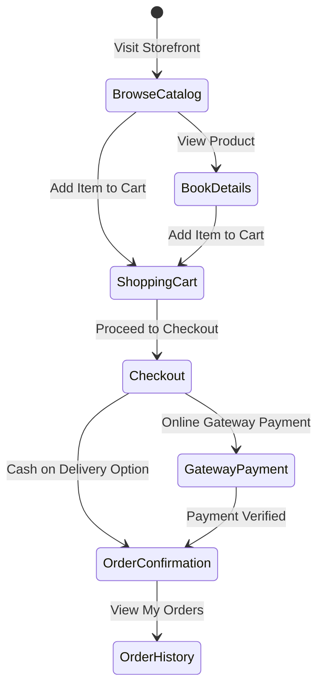
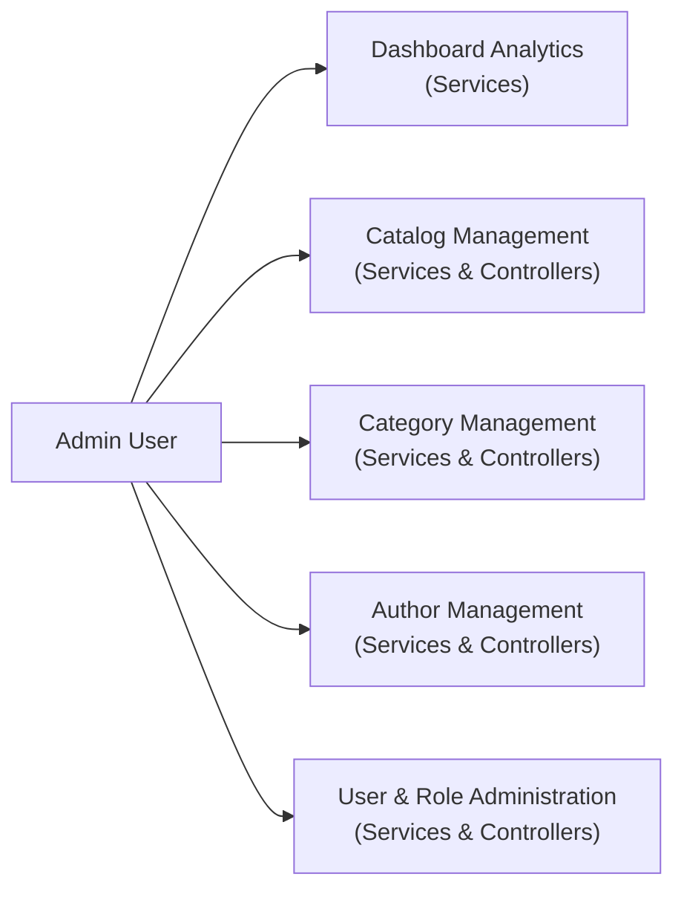

# BookStore - Functional Features & Business Rules

## System Functional Architecture

BookStore is structured into two primary functional areas:
1. **Customer Storefront Portal**: Public e-commerce capabilities for browsing catalog items, shopping cart management, checkout, order tracking, and payment processing.
2. **Administrative Management Portal (`Areas/Admin`)**: Administrative workspace for managing catalog items, inventory levels, user access, security roles, and metrics.

---

## 1. Customer Storefront Domain

### 1.1 Catalog Search, Filtering & Pagination
* **Catalog Exploration Rules**:
  * Customers can perform keyword searches on product titles.
  * Multi-criteria filtering allows segmenting products by **Category**, **Author**, and **Publisher**.
  * Server-side pagination is enforced by the business service layer to ensure consistent performance.

### 1.2 Shopping Cart Management
* **Session State Engine**: Shopping cart items are maintained within the HTTP session state using serialized data models.
* **Cart Operations**:
  * **Add Item**: Increments existing item quantities or adds new product entries.
  * **Update Quantity**: Validates requested item quantities against current stock levels.
  * **Remove Item**: Removes selected items from the session cart.

### 1.3 Order Checkout & Calculation Rules
* **Financial Calculation Model**:
  $$\text{Total Amount} = \text{Subtotal} = \sum (\text{UnitPrice} \times \text{Quantity})$$

* **Stock Allocation Rule**:
  During order submission, the order management service verifies stock availability. Upon order placement, inventory is deducted:
  $$\text{StockQuantity}_{\text{new}} = \text{StockQuantity}_{\text{current}} - \text{OrderItemQuantity}$$

### 1.4 Order Status Lifecycle
Orders transition through structured states:
* `Pending`: Order created; awaiting payment verification or processing.
* `Paid`: Online payment verified via payment gateway integration.
* `Processing`: Order being prepared for fulfillment.
* `Completed`: Order fulfilled and delivered to customer.
* `Cancelled`: Order aborted due to payment failure or administrative cancellation.

---

## 2. Administrative Management Domain (`Areas/Admin`)

### 2.1 Catalog & Media Management
* **Product CRUD Operations**: Administrative management of book details, ISBN numbers, pricing, stock levels, publisher links, category assignments, and author relationships.
* **Media Handling**: Product cover images are uploaded via multipart form streams, validated, and stored within static asset storage under `wwwroot`. Relative paths are saved in the data store.

### 2.2 Category & Author Management
* Management of product classification categories and author biographies linked via many-to-many relationship structures.

### 2.3 User & Security Administration
* Administrative identity services handle user account management, role allocation (`Admin` vs `Customer`), and account lock/unlock capabilities.

### 2.4 Dashboard Analytics
* Operational metrics compiled for administrative reporting:
  * **Total Sales Revenue** ($\sum \text{OrderTotal}$ for valid orders)
  * **Total Orders Count**
  * **Catalog Product Count**
  * **Registered Customer Count**
  * **Recent Orders Activity Feed**
