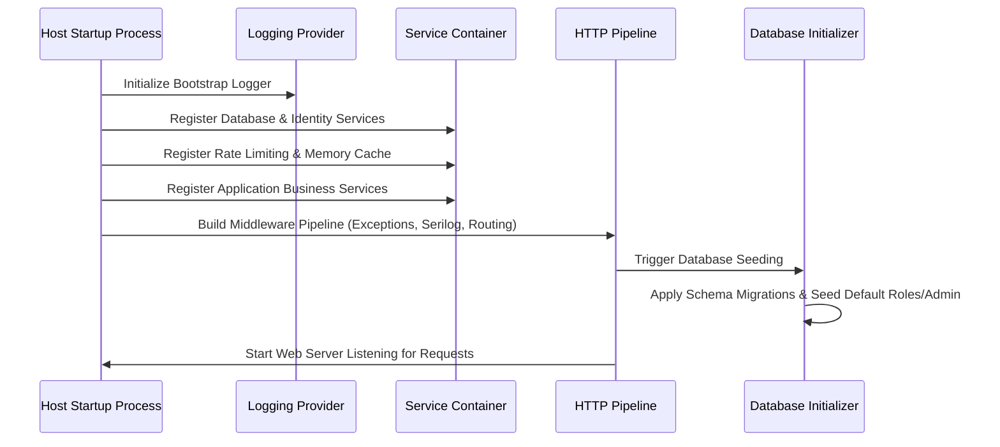

# BookStore - Getting Started & Configuration Guide

## Overview

This guide provides instructions to configure, build, and run the **BookStore** application in local development and production environments.

---

## Prerequisites

Ensure the following tools are available on your environment:

* **.NET 10.0 SDK** (v10.0.x or later)
* **SQL Server** (LocalDB, SQL Server Express, or standard SQL Server 2022+)
* **Git** (for source version control)

---

## Configuration Management

The application relies on ASP.NET Core hierarchical configuration sources:

### 1. Application Settings (`appsettings.json`)
Defines base settings, database connection strings, logging sink properties, and external gateway base URLs:

```json
{
  "ConnectionStrings": {
    "DefaultConnection": "Server=(localdb)\\mssqllocaldb;Database=BookStore;Trusted_Connection=True;MultipleActiveResultSets=true"
  },
  "AllowedHosts": "*",
  "Serilog": {
    "MinimumLevel": {
      "Default": "Information",
      "Override": {
        "Microsoft": "Warning",
        "System": "Warning"
      }
    }
  }
}
```

### 2. Environment & Secrets Management
Sensitive configurations (API keys, integration secrets, production connection strings) are stored outside source control:
* **Development**: Managed via ASP.NET Core Secret Manager (`dotnet user-secrets`).
* **Production**: Injected dynamically via host environment variables or deployment pipeline secrets.

---

## Application Startup & Bootstrapping Sequence

Application startup and middleware composition follow a structured execution lifecycle:



---

## Step-by-Step Execution Guide

### 1. Clone & Configure
```bash
git clone https://github.com/Khaled91067/BookStore.git
cd BookStore
```

### 2. Database Connection Setup
Configure `ConnectionStrings:DefaultConnection` in local application configuration or user secrets targeting your local SQL Server instance.

### 3. Apply Schema Migrations
Execute Entity Framework Core migration updates to create database tables:

```bash
dotnet ef database update --project BookStore
```

### 4. Build and Run
```bash
dotnet run --project BookStore
```

Upon initial launch, the database initializer executes to:
* Seed standard system roles (`Admin`, `Customer`).
* Create a default administrator user account.
* Populate initial catalog reference data (categories, authors, publishers, books).
