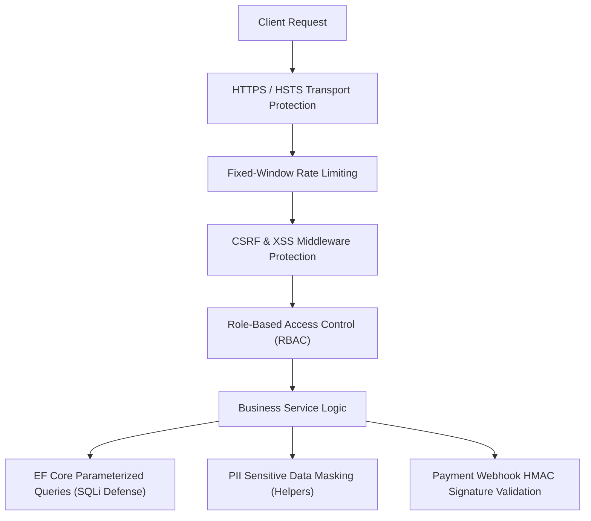

# BookStore - Security & Compliance Specification

## Overview

The **BookStore** application implements security controls across authentication, authorization, communication protocols, data persistence, integration boundaries, and logging infrastructure.

---

## Security Controls Architecture

---

## Threat Matrix & Security Controls

| Threat Category | Risk Level | Mitigation Mechanism |
| :--- | :--- | :--- |
| **Cross-Site Request Forgery (CSRF)** | High | Anti-Forgery tokens embedded in POST/PUT Razor form submissions (`@Html.AntiForgeryToken()`). |
| **SQL Injection (SQLi)** | Critical | Database queries execute via Entity Framework Core LINQ parameterized queries. |
| **Cross-Site Scripting (XSS)** | High | Razor rendering engine automatically HTML-encodes model values prior to rendering. |
| **Brute Force & DoS Attacks** | High | Fixed-window Rate Limiting policies partitioned by remote client IP address. |
| **Session Security** | Critical | Authentication cookies configured with `HttpOnly = true`, `SecurePolicy = Always`, and `SameSite` protections. |
| **PII Data Exposure in Logs** | Medium | Utility helpers in `Helpers` sanitize email addresses, phone numbers, and payment cards prior to logging. |
| **Webhook Tampering / Spoofing** | High | Inbound payment gateway webhooks validate SHA-512 HMAC signatures against shared secrets (`Paymob:Hmac`). |
| **Unauthorized Admin Access** | Critical | Administrative endpoints under `Areas/Admin` are protected by area authorization rules and `Admin` role requirements (`[Authorize(Roles = "Admin")]`). |

---

## Transport & Secrets Security Policies

### 1. Transport Security
* **HTTPS Enforcement**: Directs HTTP requests to HTTPS using `app.UseHttpsRedirection()`.
* **HSTS Policy**: Applies HTTP Strict Transport Security (HSTS) headers in production environments (`app.UseHsts()`).

### 2. Secrets Management
* **Development**: Connection strings and integration keys are managed outside source control using ASP.NET Core Secret Manager or local environment variables.
* **Production**: Production secrets are injected into environment variables via host environment configuration or GitHub Action secrets.

---

## Developer Security Checklist

1. **Form Protection**: Include anti-forgery tokens on state-modifying Razor forms and validate anti-forgery tokens on target POST controller actions.
2. **Endpoint Authorization**: Ensure administrative endpoints are located within `Areas/Admin` and attributed with required role authorization.
3. **Log Sanitization**: Pass log inputs containing customer details through PII masking helpers residing in `Helpers`.
4. **Secret Storage**: Avoid hardcoding connection strings or API keys in source repository files.
